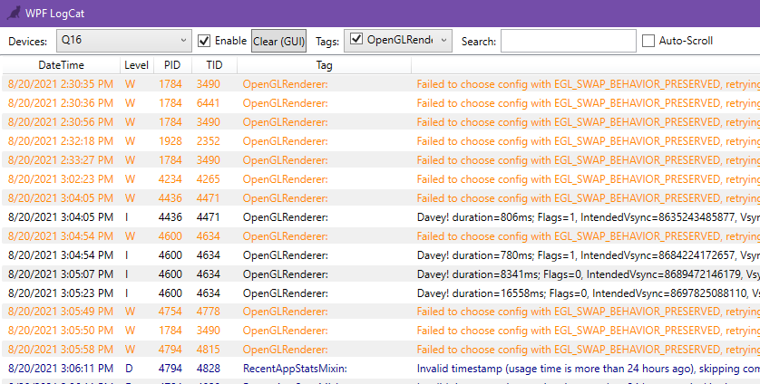

# WpfLogcat

Also just what the world needed

# Developer
Here's hoping that MAUI won't suck as hard

# TODO:
* Fix Application.Current.Dispatcher spamming during initial logcat load
* Support multiple device selection from ADB
* support different ADB path
* "Clear" for search text
* "Clear" for log
* "Clear" for device's log
